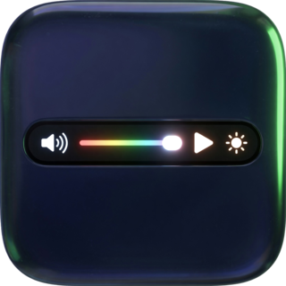
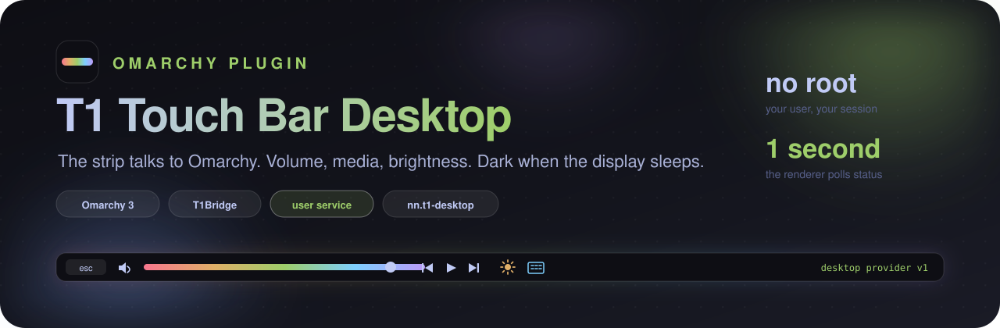
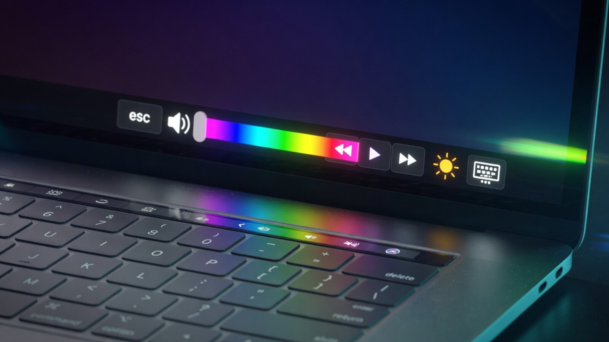
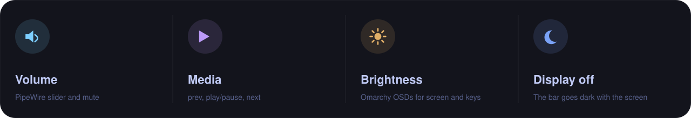
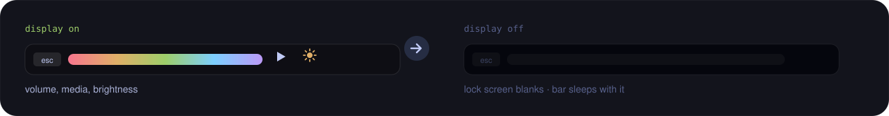
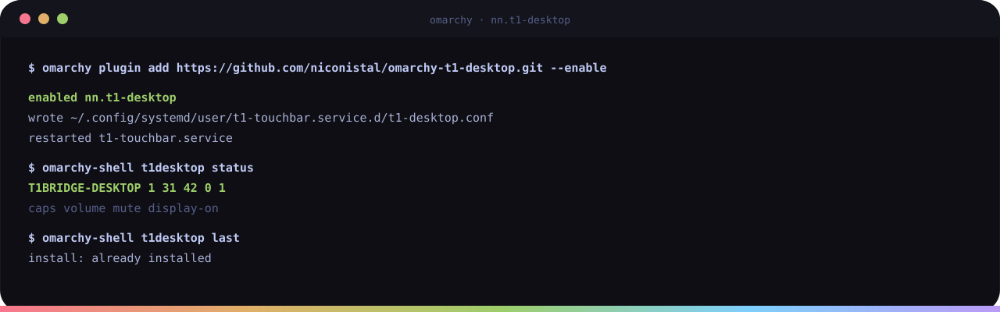

<div align="center">





**An [Omarchy](https://omarchy.org) plugin that wires the Touch Bar of a T1 MacBook Pro, driven by [T1Bridge](https://github.com/standardagents/t1bridge), to the desktop it sits under.**

[](LICENSE)
[](#install)
[](https://github.com/standardagents/t1bridge)
[](#how-it-works)
[](#requirements)

[Install](#install) ·
[Requirements](#requirements) ·
[Remove](#remove) ·
[How it works](#how-it-works)

</div>

---

T1Bridge's built-in renderer paints the Touch Bar but deliberately knows
nothing about the desktop. It looks for an optional *desktop provider*, an
executable it polls once a second for the current state and calls once per
Touch Bar action. This plugin is that provider for Omarchy. With it enabled
the Touch Bar gains:



<p align="center"><sub>Volume, media and brightness — on the strip, talking to the desktop.</sub></p>



- volume slider and mute, backed by PipeWire (`wpctl`);
- previous, play/pause and next media keys when `playerctl` is installed;
- the Omarchy on-screen display for the display brightness and keyboard
  backlight keys;
- a desktop notification if a custom renderer falls over and the built-in one
  takes over;
- a dark Touch Bar whenever Omarchy turns the display off, such as after the
  lock screen blanks, and the controls back the moment the display wakes.



Nothing here runs with privileges. The provider is a plain script run as your
user by the T1Bridge user service.

## Install

```sh
omarchy plugin add https://github.com/niconistal/omarchy-t1-desktop.git --enable
```



Enabling the plugin starts a small background service in the Omarchy shell.
On start it writes a systemd user drop-in for `t1-touchbar.service` that
points `T1BRIDGE_DESKTOP_PROVIDER` at the provider inside the plugin
directory and restarts the renderer once. Re-enabling later is idempotent.

Check the wiring at any time:

```sh
omarchy-shell t1desktop status
omarchy-shell t1desktop last
```

## Requirements

- Omarchy 3 with the Quickshell shell.
- T1Bridge installed and its `t1-touchbar` user service running.
- `playerctl` for the media keys (optional).

The dark-display behavior needs a T1Bridge renderer that understands the
`display power` capability of the desktop provider contract. The plugin
checks the installed `t1bridge` package version and only advertises display
power to a renderer that accepts it, so older releases still get everything
else. If you run a renderer built from newer sources, set
`T1_DESKTOP_DISPLAY_POWER=1` in the drop-in the plugin wrote at
`~/.config/systemd/user/t1-touchbar.service.d/t1-desktop.conf`.

## Remove

```sh
omarchy-shell t1desktop uninstall
omarchy plugin remove nn.t1-desktop
```

The first command deletes the drop-in and restarts the renderer so the Touch
Bar goes back to the stock T1Bridge controls. Removing the plugin without it
is harmless: the renderer notices the missing provider and hides the desktop
controls on its own.

## How it works

`t1-desktop-provider` implements desktop provider v1 from the T1Bridge
[interfaces](https://github.com/standardagents/t1bridge/blob/main/docs/interfaces.md)
document. `status` reports capabilities, the default sink volume and mute,
and whether any enabled monitor is powered according to Hyprland. Every call
stays well inside the contract's 500 ms deadline and 128 byte output limit.

`t1-desktop-setup` owns the systemd drop-in. `Service.qml` runs it on shell
start and exposes the `t1desktop` IPC target.

## License

MIT.
